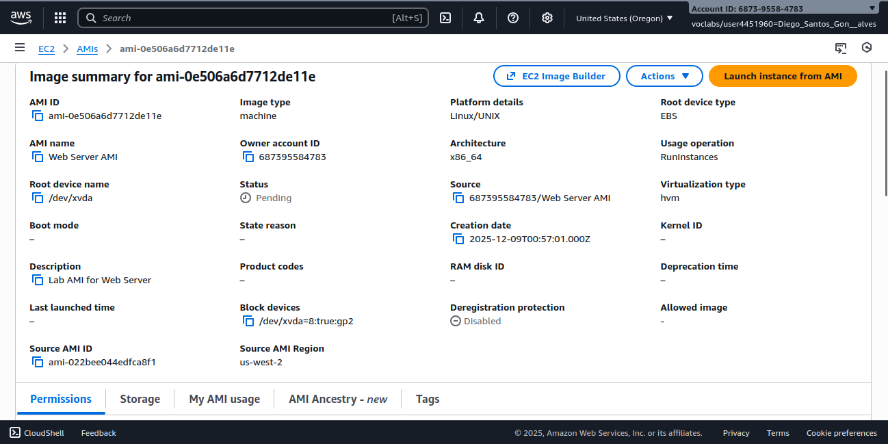
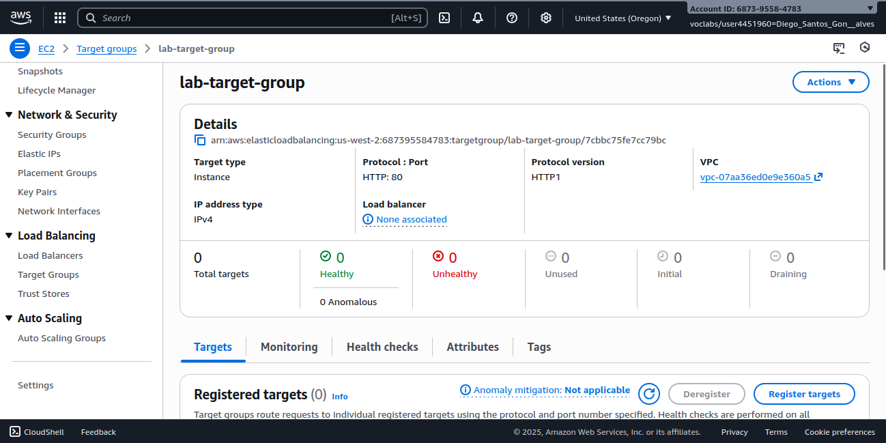
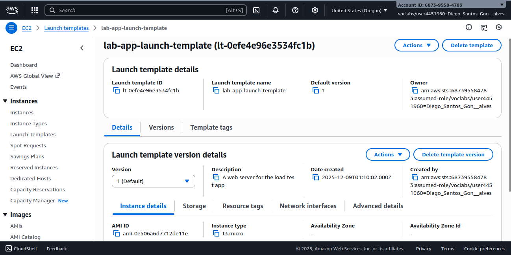
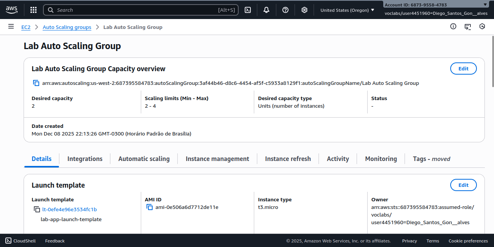
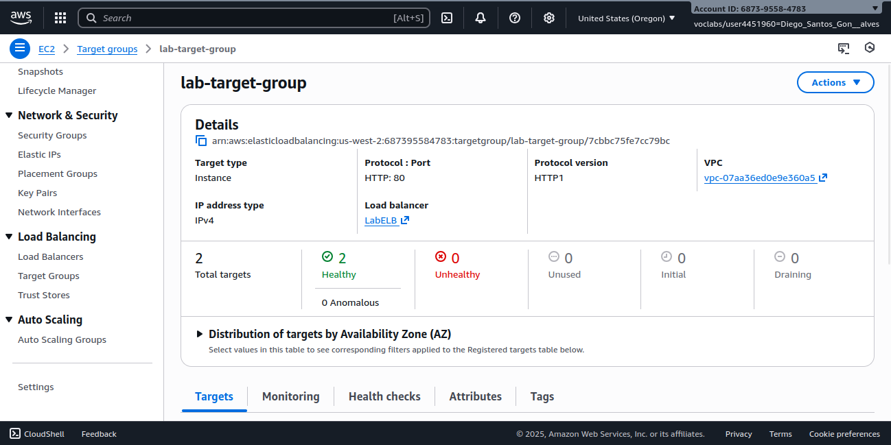
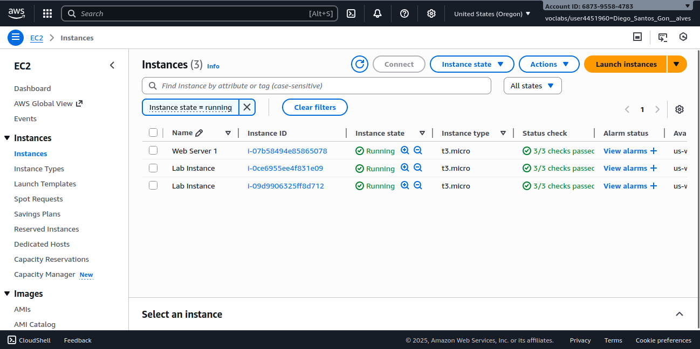
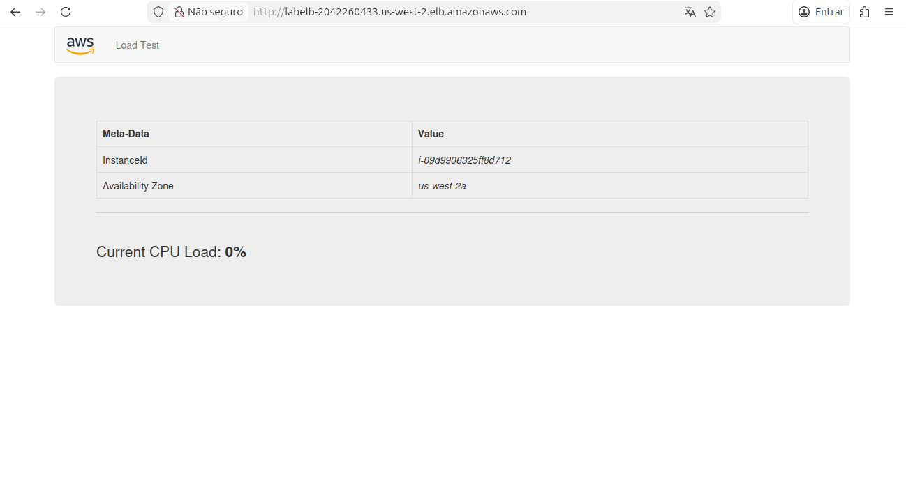
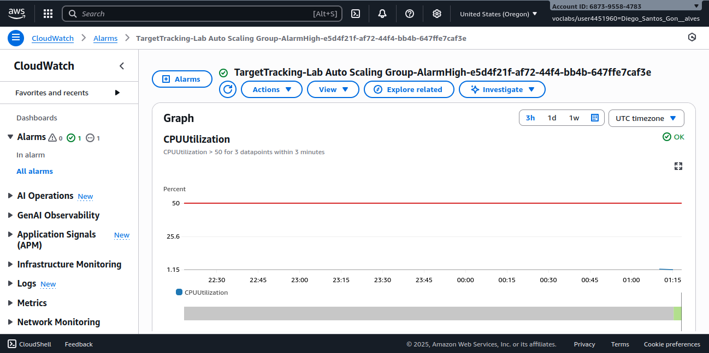
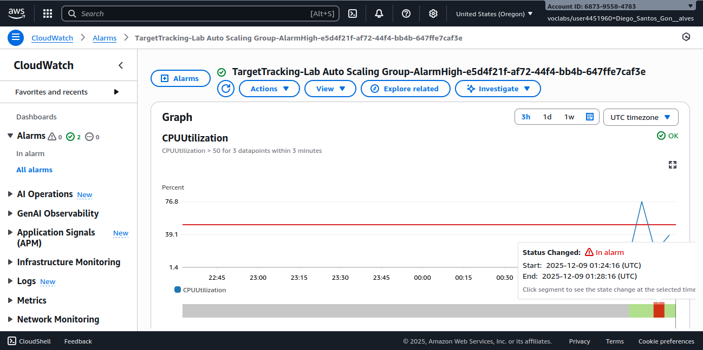
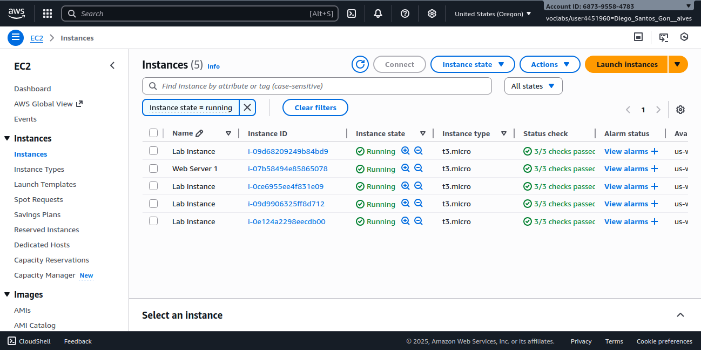

# 📈 Documentação: Auto Scaling e Load Balancing na AWS

Este repositório contém a documentação prática do laboratório realizado no programa **AWS re/Start**, focado em **Elasticidade e Alta Disponibilidade**.

Neste projeto, configurei uma infraestrutura capaz de escalar automaticamente (aumentar e diminuir recursos) baseada na demanda de CPU, garantindo que a aplicação permaneça disponível e performática, distribuindo o tráfego de forma equilibrada entre várias instâncias.

-----

## 🧠 Habilidades adquiridas

  * Criar Imagens de Máquina da Amazon (AMI) personalizadas
  * Configurar e implantar um **Application Load Balancer (ALB)**
  * Criar Modelos de Execução (Launch Templates) para padronização de instâncias
  * Configurar grupos de **Auto Scaling (ASG)** com políticas de escalabilidade dinâmica
  * Definir e testar alarmes do **Amazon CloudWatch**
  * Realizar testes de estresse (Stress Test) para validar a elasticidade da arquitetura

-----

## 🛠️ Tecnologias Utilizadas

<div align="left">       </div>

-----

## 📁 Estrutura do Repositório

`aws-auto-scaling-lab`

```
├── imagens/
├── README.md
```

-----

## 🏗️ Arquitetura Inicial:


## 🔧 Etapas Realizadas

### 1. Criação da Imagem Padrão (AMI)

A partir de um servidor web (Web Server 1) já configurado, criei uma **AMI (Amazon Machine Image)**. Isso garante que todas as novas instâncias lançadas automaticamente tenham as mesmas configurações e a aplicação já instalada.



-----

### 2. Configuração do Application Load Balancer (ALB)

Para distribuir o tráfego, criei um Balanceador de Carga de Aplicação (**LabELB**) abrangendo duas Zonas de Disponibilidade (AZs).

  * **Target Group:** Configurei um grupo de destino (`lab-target-group`) para onde o tráfego seria roteado.
  
  * **Health Checks:** Configurei verificações para garantir que o tráfego vá apenas para instâncias saudáveis.
  
  
  
-----

### 3. Definição do Modelo de Execução (Launch Template)

Criei o `lab-app-launch-template` para definir as especificações das instâncias que o Auto Scaling irá criar:

  * **AMI:** Web Server AMI (criada na etapa 1)
  * **Tipo de Instância:** t3.micro (ou t2.micro)
  * **Security Group:** Grupo de segurança da web (HTTP permitido)
  * **Tags:** Definição de nomes padrão para novas instâncias.
  
    

-----

### 4. Implementação do Auto Scaling Group (ASG)

Configurei o grupo de Auto Scaling para gerenciar a frota de instâncias EC2:

  * **Capacidade Desejada/Mínima:** 2 instâncias
  * **Capacidade Máxima:** 4 instâncias
  * **Rede:** Sub-redes privadas em múltiplas AZs para alta disponibilidade.
  * **Política de Escalonamento:** *Target Tracking Policy*. Configurei para manter a utilização média da **CPU em 50%**.
  
  

-----

### 5. Validação do Balanceamento de Carga

Após o ASG provisionar as duas instâncias iniciais, verifiquei a integridade no Target Group e acessei a aplicação através do DNS do Load Balancer.







-----

### 6. Teste de Estresse e Escalonamento Automático

Para provar a elasticidade, realizei um teste de carga:

1.  Acessei a ferramenta de "Load Test" da aplicação.

1[aplicacao web 02](imagens/08-aplicacao-web-02.png)

2.  Monitorei os alarmes do **CloudWatch** (`AlarmHigh` configurado para CPU \> 50%).



3.  Observei o alarme entrar em estado "In Alarm".



Como resposta ao alarme, o Auto Scaling provisionou novas instâncias automaticamente.



-----

## 🚀 Resultado Final

Ao final do laboratório, a arquitetura final consistia em:

  * **Alta Disponibilidade:** Aplicação rodando em múltiplas zonas de disponibilidade.
  * **Elasticidade:** O sistema reagiu ao pico de tráfego adicionando servidores e, posteriormente, removeria os excessos quando a carga baixasse.
  * **Segurança:** Instâncias rodando em sub-redes privadas, acessíveis apenas via Load Balancer.
  
  

-----

## 🧪 O que aprendi na prática

Este laboratório consolidou meu entendimento sobre:

  * A diferença entre escalabilidade vertical e horizontal (aqui focamos na horizontal).
  * Como o **Launch Template** moderniza e substitui as antigas Launch Configurations.
  * A importância de configurar **Health Checks** corretos para que o ELB não envie tráfego para instâncias falhas.
  * A automação da infraestrutura reagindo a métricas em tempo real (CPU).

-----

## 🏁 Conclusão

Concluí com sucesso a implementação de uma arquitetura resiliente e escalável na AWS, simulando um cenário real de picos de acesso em uma aplicação web.

-----

⚠️ ***Observação***

Este laboratório foi realizado em um **ambiente sandbox da AWS**, disponibilizado apenas para fins educacionais. Nesse tipo de ambiente, o acesso é temporário e os **recursos são automaticamente encerrados e excluídos ao final da sessão**.

Informações como **Account ID ou nome do usuário do laboratório podem aparecer nos prints**, mas **não representam risco de segurança**, pois não pertencem a uma conta real e não permitem qualquer acesso externo.
